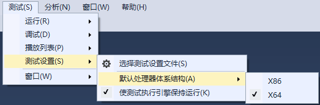

# EmotionAnalyze.AffdexExtentsion

This is an extension of [Affectiva Emotion SDK for Windows](https://knowledge.affectiva.com/docs/analyze-the-camera-stream).It will be much more easier to use Affectiva SDK with this extension.

The AutoCameraDetector can access a webcam connected to the device to capture frames and feed them directly to the facial expression engine.

The unit test project `ColinChang.EmotionAnalyze.Test` shows you how to use it.Check it to have a quick start.

>Requirements

**Runtime Requirements**

* Microsoft .NET framework v 4.6.1 or newer
* Visual C++ Redistributable runtime for VS 2015
* [Affectiva SKD](https://knowledge.affectiva.com/docs/getting-started-with-the-emotion-sdk-for-windows#section-1-download-and-run-the-sdk-installer)
* Only x64 OS was supported. 
* Add the Affdex assembly to your project.It's under your SDK directory by default.Use the release version dll.
* copy `affdex-native.dll`,`tensorflow.dll` to your execute directory

**Hardware requirements (recommended)**
* Processor, 2 GHz
* RAM, 1 GB
* Disk Space (min) : 950 MB

> Run the unit test under x64 mode

